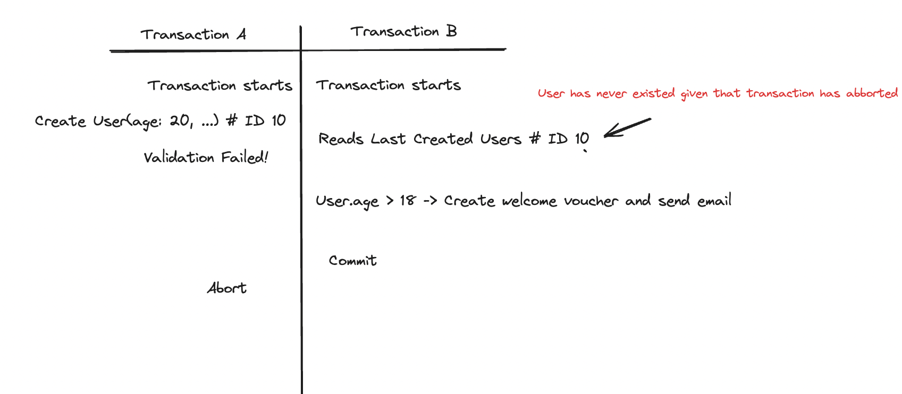

# Transaction Isolation Level

In RDMS (Relational Database Management Systems) we have the ACID which is a set of properties ensured by the database within a Transaction.
ACID stands for: Atomicity, Consistency, Isolation and Durability.

The Isolation refers to the ability of a RDMS to isolate a transaction from another one, even being run in parallel. Before jumping into the Isolation, it is important to understand some anomalies that could happen in case of two transactions are trying to access and update the same data at the same time.

## Read Phenomena

Read phenomena represents the different read issues that can occur when two transactions access the same data at the same time (race condition).

### Dirty Reads
Transaction A can read NON-COMMITTED data from Transaction B.

### Non Repeatable Read
If Transaction A asks for the same row twice, and Transaction B updates and commits the same row in the middle of each read made by Transaction A, Transaction A will get two different values.

### Phantom Read
If Transaction A asks for a Query under some criterias twice, and Transaction B updates or adds new values that matches the criterias of the Query being run in Transaction A, then Transaction A will get two different values for the same Query.